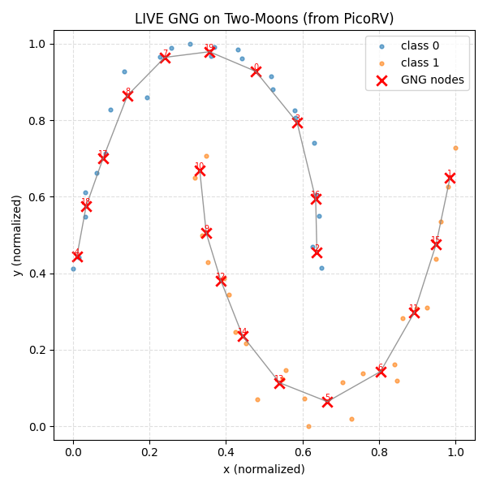

# fpga_gng


# 📘 **README – Build & Flash Firmware on Windows Using MSYS2 + MinGW64 + xPack RISC-V Toolchain**

This tutorial explains how to:

1. Install **MSYS2** on Windows
2. Install **MinGW64 build tools**
3. Install **Python (MinGW64)**
4. Install **pyserial**
5. Install **xPack RISC-V Embedded GCC** (required for RISC-V firmware compilation)
6. Configure the Makefile to use the correct Python interpreter
7. Build the firmware
8. Flash the firmware using `make program`

This documentation is intended for the **fpga_gng/picotiny** project.

---

# 🧰 1. Install MSYS2

Download from:

👉 [https://www.msys2.org/](https://www.msys2.org/)

Install using default settings.

After installation, **open MSYS2 MinGW64 terminal**, not MSYS or UCRT64.

---

# 🔄 2. Update MSYS2 Package Database

Run:

```
pacman -Syu
```

Close MSYS2 → reopen MinGW64 terminal → run again:

```
pacman -Syu
```

---

# 🛠️ 3. Install MinGW64 Build Tools

Install development tools:

```
pacman -S --needed base-devel
pacman -S --needed mingw-w64-x86_64-toolchain
```

Verify installation:

```
make --version
gcc --version
```

---

# 🐍 4. Install Python (MinGW64 Version)

Install Python for MinGW64:

```
pacman -S mingw-w64-x86_64-python
```

Check:

```
/mingw64/bin/python --version
```

---

# 🔌 5. Install pyserial (Required for Flashing via COM Port)

```
pacman -S mingw-w64-x86_64-python-pyserial
```

Test:

```
/mingw64/bin/python -c "import serial; print('OK')"
```

If it prints “OK”, pyserial is correctly installed.

---

# 🧩 6. Install xPack RISC-V Embedded GCC (Required Compiler)

Download from:

👉 [https://xpack.github.io/riscv-none-embed-gcc/](https://xpack.github.io/riscv-none-embed-gcc/)

Choose the Windows `.zip` release (not installer).

Example folder path after extraction:

```
C:\xpack-riscv-none-embed-gcc\12.2.0-1\bin
```

Add this folder to PATH inside MSYS2.
Edit your `~/.bashrc`:

```
nano ~/.bashrc
```

Add:

```
export PATH="/c/xpack-riscv-none-embed-gcc/12.2.0-1/bin:$PATH"
```

Reload:

```
source ~/.bashrc
```

Check:

```
riscv-none-embed-gcc --version
```

You should see xPack GCC version info.

---

# 📂 7. Clone the Repository

```
git clone https://github.com/yourname/fpga_gng.git
cd fpga_gng/picotiny
```

---

# 🐍 8. Configure Makefile to Use the Correct Python

MSYS2 has two Python versions:

| Interpreter        | Path                  | pyserial support |
| ------------------ | --------------------- | ---------------- |
| **MSYS Python**    | `/usr/bin/python`     | ❌ does NOT work  |
| **MinGW64 Python** | `/mingw64/bin/python` | ✔ works          |

Edit the Makefile:

Find:

```
PYTHON = python
```

Replace with:

```
PYTHON = /mingw64/bin/python
```

Or (recommended):

```
PYTHON ?= /mingw64/bin/python
```

---

# 🏗️ 9. Build the Firmware

Run:

```
make
```

The compiled bitstream will be generated in:

```
fw/fw-flash/build/fw-flash.v
```

---

# 🔥 10. Flash the Firmware

Connect your RP2040/PicoTiny board via USB (COM port).

Run:

```
make program
```

If needed, override Python manually:

```
make PYTHON=/mingw64/bin/python program
```

Or directly:

```
/mingw64/bin/python sw/pico-programmer.py fw/fw-flash/build/fw-flash.v COM14
```

Change `COM1` to your actual port.

# GNG Result in FPGA (PicoRV32)




# neorv32 explanation

you need to get neorv32 first, well currently i'm using v1.12.5

```
git clone https://github.com/tzf230201/fpga_gng.git
cd fpga_gng
git clone https://github.com/stnolting/neorv32.git
```

or use the same version as me, download zip version and extract

```
https://github.com/stnolting/neorv32/releases/tag/v1.12.5
```

and my reference for implementing neorv32 in tang nano 9k is form this 

```
https://github.com/jimmyw/tang_nano_9k_neorv32
```

but it seemslike the code kind of old version, so several things is not compatible anymore, especially for bootloader.

so i decided to build a new one, i plan to have different direction with mr.jimmyw, i want to make it more arduino like.

btw i also want to give credit to this

```
https://github.com/grughuhler/picorv32_tang_nano_unified
```

for the original version of `uart_upload.py`, but, i modify the code based to be compatible with newer bootloader version.

many thanks.


let's get back to neorv32,

so neorv32 is an FPGA based CPU by Mr. Stephan Nolting
i like it becuse it's super customable, you can make it only have 1 uart or 2 uart, how many pwm output, how many spi and so on.

for now i'm talk about implementing neorv32 in gowin fpga.

but the main problem is, all the code of neorv32 is in VHDL.
so there is no non-volatile memory inside the design of CPU.

so, the only way to program this CPU is to embed it into HDL code. 

or, boot from external memory, such as, spi flash, uSD card, and so on.

there is an option to boot via UART, but, right after the power loss,  the instructions gone. 


if we embed to hdl it's okay, the boot will still there even though power loss, but the problem is when we change the code, we need to sinthesize again and over again, this take so much time compare to compile via UART.

so for UART boot:
adventage: faster, only compile and send via uart time consuming
disadvantage: the code gone when power loss.

for HDL embed boot:
advantange: the code still there when power loss
disadventage: slower, time consuming to convert .bin to hdl + re-synthesis and re-"place and root" the hdl files.

so what is the best way for now?

we need an external memory for store the instruction.

fortunately, gowin FPGA came with user flash memory, we can use that to store code from UART. 

but another problem is, how to make it boot from user flash if uart not exist.