# FPGA GNG Implementation

Growing Neural Gas on FPGA

<div class="pt-12">
  <span @click="$slidev.nav.next" class="px-2 py-1 rounded cursor-pointer" hover="bg-white bg-opacity-10">
    Press Space for next page <carbon:arrow-right class="inline"/>
  </span>
</div>

---

# Agenda

- 📝 **Introduction** - Apa itu Growing Neural Gas?
- 🧠 **GNG Algorithm** - Algoritma Fritzke secara detail
- 🎯 **Project Overview** - Arsitektur dan implementasi
- ⚡ **Hardware Design** - FPGA implementation details
- 📊 **Results** - Perbandingan performa
- 🎨 **Demo** - Live demonstration

---

# Apa itu Growing Neural Gas (GNG)?

**Growing Neural Gas** adalah algoritma **unsupervised learning** yang diperkenalkan oleh **Bernd Fritzke (1995)** untuk:

<v-clicks>

- 🧠 **Clustering adaptif** - Mengelompokkan data tanpa label
- 📊 **Vector Quantization** - Merepresentasikan data dengan set prototype
- 🗺️ **Topology Learning** - Mempelajari struktur topologi data
- 📈 **Dynamic Growth** - Jaringan tumbuh sesuai kompleksitas data

</v-clicks>

<br>

<v-click>

> **Keunggulan GNG**: Tidak perlu menentukan jumlah neuron di awal! Jaringan akan tumbuh secara otomatis sesuai dengan distribusi data.

</v-click>

---

# Konsep Dasar GNG


<br>

<v-clicks>

- **Neurons (Nodes)**: Representasi pusat cluster dalam ruang data
- **Edges**: Koneksi antar neuron yang menunjukkan kedekatan topologi
- **Error**: Setiap neuron menyimpan akumulasi error lokal
- **Age**: Setiap edge memiliki usia untuk menghapus koneksi yang tidak relevan

</v-clicks>

---

# Visualisasi Cara Kerja GNG

```mermaid
graph LR
    subgraph "Step 1: Initial"
        N1((N1))
        N2((N2))
    end
    
    subgraph "Step 2: Add Input"
        N3((N1))
        N4((N2))
        I1[●Input]
    end
    
    subgraph "Step 3: Find Winners"
        N5((N1✓))
        N6((N2✓))
        I2[●Input]
        I2 -.Winner.-> N5
        I2 -.2nd.-> N6
    end
    
    subgraph "Step 4: Update & Connect"
        N7((N1))
        N8((N2))
        N7 --- N8
        I3[●Input]
    end
    
    style N5 fill:#90EE90
    style N6 fill:#FFD700
    style I1 fill:#FF6B6B
    style I2 fill:#FF6B6B
    style I3 fill:#FF6B6B
```

---

# GNG by Fritzke (1994)

## Urutan Algoritma Linear


<div class="text-center mt-4">
  <span class="text-sm opacity-75">Repeat until termination condition</span>
</div>

---

# Animasi: Urutan Langkah yang Ditukar

<div class="grid grid-cols-2 gap-6">

<div>

## Urutan A (asli)


</div>

<div v-click>

## Urutan B (ditukar)


</div>

</div>

<br>

<v-clicks>

- ✅ **Animasi swap**: Edge aging, error accumulation, dan move neighbors bisa ditukar urutannya
- ✅ **Inti tetap sama**: Tetap menggunakan s1 dan s2 dari langkah sebelumnya
- ✅ **Visual fokus**: Menunjukkan bahwa tiga langkah ini bisa dipresentasikan dengan urutan berbeda
- ⚠️ **Wajib dulu**: Find winner (s1, s2) harus sebelum ketiga langkah ini
- ⚠️ **Tidak boleh salah**: Connect/Reset (s1, s2) harus setelah ketiga langkah selesai

</v-clicks>

---

# Langkah 1: Initialize Two Nodes

**Inisialisasi jaringan dengan 2 neuron**

<v-clicks>

- Buat 2 neuron dengan posisi random: $w_1, w_2 \in \mathbb{R}^n$
- Set error counter: $E_1 = 0, E_2 = 0$
- Belum ada edge/koneksi

</v-clicks>

<br>

<v-click>

```mermaid
graph LR
    N1((w₁<br/>E=0))
    N2((w₂<br/>E=0))
    
    style N1 fill:#4A90E2,color:#fff
    style N2 fill:#4A90E2,color:#fff
```

</v-click>

<br>

<v-click>

```c
// Inisialisasi
neuron[0].x = random(); neuron[0].y = random(); neuron[0].error = 0;
neuron[1].x = random(); neuron[1].y = random(); neuron[1].error = 0;
num_neurons = 2;
```

</v-click>

---

# Langkah 2: Sample Input ξ

**Ambil satu input vector secara random dari dataset**

<v-clicks>

- Pilih data point $\xi \in \mathbb{R}^n$ dari distribusi input
- Bisa dari dataset training atau stream data real-time

</v-clicks>

<br>

<v-click>

```mermaid
graph TD
    D[Dataset] --> X1[ξ₁]
    D --> X2[ξ₂]
    D --> X3[ξ₃]
    D --> Xn[...]
    X2 -.Selected.-> I[Current Input ξ]
    
    style I fill:#FF6B6B,color:#fff
    style X2 fill:#FFD700
```

</v-click>

<br>

<v-click>

```c
// Sampling
float xi[2] = {dataset[sample_idx].x, dataset[sample_idx].y};
```

</v-click>

---

# Langkah 3: Find s1, s2

**Cari 2 neuron terdekat dengan input**

<v-clicks>

- **s1 (winner)**: Neuron paling dekat dengan $\xi$

$$
s_1 = \arg\min_{i} \|\xi - w_i\|
$$

- **s2 (second winner)**: Neuron terdekat kedua

$$
s_2 = \arg\min_{i \neq s_1} \|\xi - w_i\|
$$

</v-clicks>

<br>

<v-click>

```c
// Find winners
float min_dist1 = INFINITY, min_dist2 = INFINITY;
int s1 = -1, s2 = -1;
for(int i = 0; i < num_neurons; i++) {
    float dist = distance(xi, neuron[i]);
    if(dist < min_dist1) {
        min_dist2 = min_dist1; s2 = s1;
        min_dist1 = dist; s1 = i;
    } else if(dist < min_dist2) {
        min_dist2 = dist; s2 = i;
    }
}
```

</v-click>

---

# Animasi: Find s1, s2 → Move Neurons

<div class="grid grid-cols-2 gap-8">

<div>

## Step 1: Initial State
```mermaid
graph TD
    I[●ξ<br/>Input]
    N1((n₁))
    N2((n₂))
    N3((n₃))
    N4((n₄))
    N5((n₅))
    
    N1 --- N2
    N2 --- N3
    N4 --- N5
    
    style I fill:#FF6B6B,color:#fff
    style N1 fill:#E0E0E0
    style N2 fill:#E0E0E0
    style N3 fill:#E0E0E0
    style N4 fill:#E0E0E0
    style N5 fill:#E0E0E0
```
**Data point muncul**

</div>

<div v-click>

## Step 2: Find Winners
```mermaid
graph TD
    I[●ξ<br/>Input]
    N1((n₁))
    N2((n₂<br/>s₁✓))
    N3((n₃<br/>s₂✓))
    N4((n₄))
    N5((n₅))
    
    N1 --- N2
    N2 --- N3
    N4 --- N5
    
    I -.1st.-> N2
    I -.2nd.-> N3
    
    style I fill:#FF6B6B,color:#fff
    style N2 fill:#90EE90,color:#000
    style N3 fill:#FFD700,color:#000
    style N1 fill:#E0E0E0
    style N4 fill:#E0E0E0
    style N5 fill:#E0E0E0
```
**s₁ = closest, s₂ = 2nd closest**

</div>

</div>

---

# Animasi: Move s1 and Neighbors (1/2)

<div class="grid grid-cols-2 gap-8">

<div>

## Step 3: Move s₁ (Winner)
```mermaid
graph TD
    I[●ξ]
    N1((n₁))
    N2((n₂<br/>s₁))
    N2B((n₂'))
    N3((n₃<br/>s₂))
    N4((n₄))
    N5((n₅))
    
    N1 --- N2B
    N2B --- N3
    N4 --- N5
    
    N2 -.εw=0.05.-> N2B
    I -.pull.-> N2B
    
    style I fill:#FF6B6B,color:#fff
    style N2 fill:#90EE90,color:#000,stroke-dasharray: 5 5
    style N2B fill:#90EE90,color:#000
    style N3 fill:#FFD700,color:#000
    style N1 fill:#E0E0E0
    style N4 fill:#E0E0E0
    style N5 fill:#E0E0E0
```
**Δw = 0.05 × (ξ - w_s₁)**

</div>

<div v-click>

## Step 4: Move Neighbors
```mermaid
graph TD
    I[●ξ]
    N1((n₁))
    N1B((n₁'))
    N2B((n₂'<br/>s₁))
    N3((n₃<br/>s₂))
    N3B((n₃'))
    N4((n₄))
    N5((n₅))
    
    N1B --- N2B
    N2B --- N3B
    N4 --- N5
    
    N1 -.εn.-> N1B
    N3 -.εn.-> N3B
    
    style I fill:#FF6B6B,color:#fff
    style N2B fill:#90EE90,color:#000
    style N1 fill:#87CEEB,stroke-dasharray: 5 5
    style N1B fill:#87CEEB
    style N3 fill:#87CEEB,stroke-dasharray: 5 5
    style N3B fill:#87CEEB
    style N4 fill:#E0E0E0
    style N5 fill:#E0E0E0
```
**Δw = 0.0006 × (ξ - w_neighbor)**

</div>

</div>

---

# Animasi: Move s1 and Neighbors (2/2)

## Step 5: Final Result

```mermaid
graph TD
    I[●ξ<br/>Input]
    N1B((n₁'))
    N2B((n₂'<br/>s₁))
    N3B((n₃'<br/>s₂))
    N4((n₄))
    N5((n₅))
    
    N1B --- N2B
    N2B --- N3B
    N4 --- N5
    
    style I fill:#FF6B6B,color:#fff
    style N2B fill:#90EE90,color:#000
    style N3B fill:#FFD700,color:#000
    style N1B fill:#87CEEB
    style N4 fill:#E0E0E0
    style N5 fill:#E0E0E0
```

<br>

<v-clicks>

- ✅ **s₁ (winner)** bergerak **lebih cepat** ke arah input (ε_w = 0.05)
- ✅ **Neighbors** bergerak **lebih lambat** ke arah input (ε_n = 0.0006)
- ✅ **Non-neighbors** (n₄, n₅) **tidak bergerak**
- ✅ Topology (edges) **tetap dipertahankan**

</v-clicks>

---

# Perbandingan Learning Rate

| Neuron | Learning Rate | Magnitude | Pergerakan |
|--------|---------------|-----------|------------|
| **s₁ (Winner)** | ε_w = 0.05 | 1.0× | ████████████████████████████ |
| **Neighbors** | ε_n = 0.0006 | 0.012× | ▌ |
| **Others** | 0 | 0× | (tidak bergerak) |

<br>

<v-click>

**Mengapa perbedaan besar?**

- Winner harus **responsif** terhadap input → learning rate tinggi
- Neighbors hanya perlu **sedikit penyesuaian** untuk menjaga topology → learning rate rendah
- Non-neighbors **tidak relevan** dengan input saat ini → tidak bergerak

</v-click>

<br>

<v-click>

> **Ratio**: Winner bergerak ~**83× lebih cepat** dari neighbors (0.05 / 0.0006 ≈ 83)

</v-click>

---

# Animasi: Age s1 Edges

<div class="grid grid-cols-2 gap-8">

<div>

## Before Aging
```mermaid
graph LR
    S1((s₁))
    N1((n₁))
    N2((n₂))
    N3((n₃))
    N4((n₄))
    
    S1 ---|age: 4| N1
    S1 ---|age: 2| N2
    N2 ---|age: 5| N3
    N3 ---|age: 1| N4
    
    style S1 fill:#90EE90,color:#000
    style N1 fill:#E0E0E0
    style N2 fill:#E0E0E0
    style N3 fill:#E0E0E0
    style N4 fill:#E0E0E0
```
**Edge ages sebelum update**

</div>

<div v-click>

## After Aging s₁
```mermaid
graph LR
    S1((s₁))
    N1((n₁))
    N2((n₂))
    N3((n₃))
    N4((n₄))
    
    S1 ---|age: 5 ⬆| N1
    S1 ---|age: 3 ⬆| N2
    N2 ---|age: 5| N3
    N3 ---|age: 1| N4
    
    style S1 fill:#90EE90,color:#000
    style N1 fill:#FFD700
    style N2 fill:#FFD700
    style N3 fill:#E0E0E0
    style N4 fill:#E0E0E0
```
**Hanya edges dari s₁ yang di-increment**

</div>

</div>

<br>

<v-click>

```c
// Age edges connected to s1
for(int i = 0; i < num_edges; i++) {
    if(edge[i].from == s1 || edge[i].to == s1) {
        edge[i].age++;  // Increment
    }
}
```

</v-click>

---

# Langkah 4: Age s1 Edges

**Increment umur semua edge yang terhubung ke s1**

<v-clicks>

- Setiap edge memiliki **age counter**
- Increment age untuk semua edge dari s1:

$$
\text{age}(s_1, n) = \text{age}(s_1, n) + 1, \quad \forall n \in N(s_1)
$$

- Edge yang terlalu tua akan dihapus nanti

</v-clicks>

---

# Animasi: Σ s1 Error (Accumulate)

<div class="grid grid-cols-2 gap-8">

<div>

## Step 1: Calculate Distance
```mermaid
graph TD
    I[●ξ<br/>2.5, 3.0]
    S1((s₁<br/>2.0, 2.5<br/>E: 10.2))
    
    I -.dist = 0.559.-> S1
    
    style I fill:#FF6B6B,color:#fff
    style S1 fill:#90EE90,color:#000
```

**Distance calculation:**
$$d = \sqrt{(2.5-2.0)^2 + (3.0-2.5)^2}$$
$$d = \sqrt{0.25 + 0.25} = 0.559$$

</div>

<div v-click>

## Step 2: Accumulate Error
```mermaid
graph TD
    I[●ξ<br/>2.5, 3.0]
    S1((s₁<br/>2.0, 2.5<br/>E: 10.51))
    
    I -.Δ E = 0.312.-> S1
    
    style I fill:#FF6B6B,color:#fff
    style S1 fill:#FF6B6B,color:#fff
```

**Error accumulation:**
$$\Delta E = d^2 = 0.559^2 = 0.312$$
$$E_{new} = 10.2 + 0.312 = 10.51$$

</div>

</div>

<br>

<v-click>

```c
float dx = xi[0] - neuron[s1].x;  // 2.5 - 2.0 = 0.5
float dy = xi[1] - neuron[s1].y;  // 3.0 - 2.5 = 0.5
neuron[s1].error += (dx*dx + dy*dy);  // 10.2 + 0.312 = 10.51
```

</v-click>

---

# Langkah 5: Σ s1 Error

**Akumulasi error pada neuron winner (s1)**

<v-clicks>

- Hitung squared distance dari input ke winner:

$$
\Delta E_{s_1} = \|\xi - w_{s_1}\|^2
$$

- Update error counter:

$$
E_{s_1} = E_{s_1} + \Delta E_{s_1}
$$

- Error ini digunakan untuk menentukan **di mana insert neuron baru**

</v-clicks>

---

# Langkah 6: Move s1 and Neighbors

**Update posisi winner dan neighbors-nya**

<v-clicks>

**Move winner (s1) ke arah input:**

$$
\Delta w_{s_1} = \epsilon_w \cdot (\xi - w_{s_1})
$$

dengan $\epsilon_w$ = 0.05 (winner learning rate)

<br>

**Move semua neighbors dari s1:**

$$
\Delta w_n = \epsilon_n \cdot (\xi - w_n), \quad \forall n \in N(s_1)
$$

dengan $\epsilon_n$ = 0.0006 (neighbor learning rate)

</v-clicks>

<br>

<v-click>

```c
// Move winner
neuron[s1].x += EPSILON_W * (xi[0] - neuron[s1].x);
neuron[s1].y += EPSILON_W * (xi[1] - neuron[s1].y);

// Move neighbors
for(int i = 0; i < num_neurons; i++) {
    if(is_neighbor(s1, i)) {
        neuron[i].x += EPSILON_N * (xi[0] - neuron[i].x);
        neuron[i].y += EPSILON_N * (xi[1] - neuron[i].y);
    }
}
```

</v-click>

---

# Animasi: Connect or Reset (s1, s2)

<div class="grid grid-cols-2 gap-8">

<div>

## Case 1: Edge Exists
```mermaid
graph LR
    S1((s₁))
    S2((s₂))
    N3((n₃))
    
    S1 ---|age: 5| S2
    S1 --- N3
    I[●ξ]
    
    style S1 fill:#90EE90,color:#000
    style S2 fill:#FFD700,color:#000
    style I fill:#FF6B6B,color:#fff
```
**Before: Edge exists with age=5**

<div v-click>

```mermaid
graph LR
    S1((s₁))
    S2((s₂))
    N3((n₃))
    
    S1 ---|age: 0 ✓| S2
    S1 --- N3
    I[●ξ]
    
    style S1 fill:#90EE90,color:#000
    style S2 fill:#FFD700,color:#000
    style I fill:#FF6B6B,color:#fff
```
**After: Age reset to 0**

</div>

</div>

<div v-click>

## Case 2: No Edge
```mermaid
graph LR
    S1((s₁))
    S2((s₂))
    N3((n₃))
    
    S1 --- N3
    S2
    I[●ξ]
    
    style S1 fill:#90EE90,color:#000
    style S2 fill:#FFD700,color:#000
    style I fill:#FF6B6B,color:#fff
```
**Before: No edge between s₁ and s₂**

<div v-click>

```mermaid
graph LR
    S1((s₁))
    S2((s₂))
    N3((n₃))
    
    S1 --- N3
    S1 ---|age: 0 ✨| S2
    I[●ξ]
    
    style S1 fill:#90EE90,color:#000
    style S2 fill:#FFD700,color:#000
    style I fill:#FF6B6B,color:#fff
```
**After: New edge created**

</div>

</div>

</div>

---

# Langkah 7: Connect or Reset (s1, s2)

**Update atau buat koneksi antara s1 dan s2**

<v-clicks>

- Jika edge $(s_1, s_2)$ **sudah ada**: Reset age ke 0

$$
	ext{age}(s_1, s_2) = 0
$$

- Jika edge $(s_1, s_2)$ **belum ada**: Buat edge baru dengan age = 0

</v-clicks>

<br>

<v-click>

```c
// Connect or reset edge
int edge_idx = find_edge(s1, s2);
if(edge_idx != -1) {
    edge[edge_idx].age = 0;  // Reset age
} else {
    create_edge(s1, s2, 0);   // Create new edge
}
```

</v-click>

---

# Animasi: Remove Old or Isolated (1/2)

## Step 1: Remove Old Edges (age > 88)

<div class="grid grid-cols-2 gap-8">

<div>

```mermaid
graph LR
    N1((n₁))
    N2((n₂))
    N3((n₃))
    N4((n₄))
    N5((n₅))
    
    N1 ---|age: 45| N2
    N2 ---|age: 92 ❌| N3
    N3 ---|age: 23| N4
    N4 ---|age: 95 ❌| N5
    
    style N2 fill:#FFD700
    style N3 fill:#FFD700
    style N4 fill:#FFD700
    style N5 fill:#FFD700
```
**Before: Some edges too old**

</div>

<div v-click>

```mermaid
graph LR
    N1((n₁))
    N2((n₂))
    N3((n₃))
    N4((n₄))
    N5((n₅))
    
    N1 ---|age: 45| N2
    N3 ---|age: 23| N4
    
    style N3 fill:#FF6B6B
    style N5 fill:#FF6B6B
```
**After: Old edges removed**
**n₃ and n₅ now isolated!**

</div>

</div>

---

# Animasi: Remove Old or Isolated (2/2)

## Step 2: Remove Isolated Neurons

<div class="grid grid-cols-2 gap-8">

<div>

```mermaid
graph LR
    N1((n₁))
    N2((n₂))
    N3((n₃<br/>isolated))
    N4((n₄))
    N5((n₅<br/>isolated))
    
    N1 ---|age: 45| N2
    N3 ---|age: 23| N4
    
    style N3 fill:#FF6B6B,stroke:#f00,stroke-width:3px
    style N5 fill:#FF6B6B,stroke:#f00,stroke-width:3px
```
**Before: Isolated neurons exist**

</div>

<div v-click>

```mermaid
graph LR
    N1((n₁))
    N2((n₂))
    N4((n₄))
    
    N1 ---|age: 45| N2
    
    style N1 fill:#90EE90
    style N2 fill:#90EE90
    style N4 fill:#90EE90
```
**After: Isolated neurons deleted**
**Clean network remains**

</div>

</div>

<br>

<v-click>

```c
// Check each neuron for isolation
for(int i = 0; i < num_neurons; i++) {
    if(count_edges(i) == 0 && num_neurons > 2) {
        remove_neuron(i);  // Delete isolated neuron
    }
}
```

</v-click>

---

# Langkah 8: Remove Old or Isolated

**Hapus edge tua dan neuron terisolasi**

<v-clicks>

**Remove old edges:**

$$
	ext{if } \text{age}(i,j) > a_{max} \text{ then remove edge } (i,j)
$$

dengan $a_{max}$ = 88 (max edge age)

<br>

**Remove isolated neurons:**
- Jika neuron tidak memiliki edge sama sekali → hapus neuron tersebut
- Kecuali jika hanya tersisa 2 neuron

</v-clicks>

<br>

<v-click>

```c
// Remove old edges
for(int i = 0; i < num_edges; i++) {
    if(edge[i].age > MAX_EDGE_AGE) {
        remove_edge(i);
    }
}

// Remove isolated neurons
for(int i = 0; i < num_neurons; i++) {
    if(count_edges(i) == 0 && num_neurons > 2) {
        remove_neuron(i);
    }
}
```

</v-click>

---

# Langkah 9: Insert Node Every λ

**Setiap λ iterasi, tambahkan neuron baru**

<v-clicks>

**Jika** iteration count % λ = 0 (misal λ = 100):

1. **Find neuron dengan error tertinggi:**

$$
q = \arg\max_i E_i
$$

2. **Find neighbor dari q dengan error tertinggi:**

$$
f = \arg\max_{n \in N(q)} E_n
$$

3. **Insert neuron baru di tengah q dan f:**

$$
w_r = \frac{w_q + w_f}{2}
$$

4. **Remove edge (q,f) dan buat (q,r), (r,f)**

5. **Reduce error:**

$$
E_q = \alpha \cdot E_q, \quad E_f = \alpha \cdot E_f, \quad E_r = E_q
$$

dengan $\alpha$ = 0.5

</v-clicks>

---

# Langkah 9: Insert Node - Visualisasi

```mermaid
graph TD
    subgraph "Before Insert"
        Q1((q<br/>E=50))
        F1((f<br/>E=30))
        Q1 ---|age: 5| F1
    end
    
    subgraph "After Insert"
        Q2((q<br/>E=25))
        R((r<br/>E=25))
        F2((f<br/>E=15))
        Q2 ---|age: 0| R
        R ---|age: 0| F2
    end
    
    style Q1 fill:#FF6B6B,color:#fff
    style F1 fill:#FFD700,color:#000
    style Q2 fill:#FF6B6B,color:#fff
    style R fill:#90EE90,color:#000
    style F2 fill:#FFD700,color:#000
```

<br>

```c
// Insert new neuron every λ iterations
if(iteration % LAMBDA == 0) {
    int q = find_max_error_neuron();
    int f = find_max_error_neighbor(q);
    
    int r = create_neuron((neuron[q].x + neuron[f].x) / 2,
                          (neuron[q].y + neuron[f].y) / 2);
    neuron[r].error = neuron[q].error;
    neuron[q].error *= ALPHA;
    neuron[f].error *= ALPHA;
    
    remove_edge(q, f);
    create_edge(q, r, 0);
    create_edge(r, f, 0);
}
```

---

# Animasi: Decay All Errors

<div class="grid grid-cols-2 gap-8">

<div>

## Before Decay
```mermaid
graph LR
    N1((n₁<br/>E: 85.3))
    N2((n₂<br/>E: 120.5))
    N3((n₃<br/>E: 45.2))
    N4((n₄<br/>E: 92.7))
    
    N1 --- N2
    N2 --- N3
    N3 --- N4
    
    style N1 fill:#FFB6C1
    style N2 fill:#FF6B6B
    style N3 fill:#FFE4B5
    style N4 fill:#FFA07A
```
**High error neurons (red)**

</div>

<div v-click>

## After Decay (β = 0.9995)
```mermaid
graph LR
    N1((n₁<br/>E: 85.26))
    N2((n₂<br/>E: 120.44))
    N3((n₃<br/>E: 45.18))
    N4((n₄<br/>E: 92.65))
    
    N1 --- N2
    N2 --- N3
    N3 --- N4
    
    style N1 fill:#FFB6C1
    style N2 fill:#FF6B6B
    style N3 fill:#FFE4B5
    style N4 fill:#FFA07A
```
**Errors slightly reduced (0.05%)**

</div>

</div>

<br>

<v-click>

**Math:**
- n₁: $85.3 \times 0.9995 = 85.26$ (↓ 0.04)
- n₂: $120.5 \times 0.9995 = 120.44$ (↓ 0.06)
- n₃: $45.2 \times 0.9995 = 45.18$ (↓ 0.02)
- n₄: $92.7 \times 0.9995 = 92.65$ (↓ 0.05)

</v-click>

<v-click>

```c
for(int i = 0; i < num_neurons; i++) {
    neuron[i].error *= 0.9995;  // Slow decay
}
```

</v-click>

---

# Langkah 10: Decay All Errors

**Kurangi error semua neuron**

<v-clicks>

- Multiply error setiap neuron dengan decay factor:

$$
E_i = \beta \cdot E_i, \quad \forall i
$$

dengan $\beta$ = 0.9995 (error decay rate)

<br>

- **Tujuan**: 
  - Error lama akan "dilupakan"
  - Fokus pada area yang sedang dipelajari
  - Prevent error accumulation tak terbatas

</v-clicks>

<br>

<v-click>

```c
// Decay all errors
for(int i = 0; i < num_neurons; i++) {
    neuron[i].error *= BETA;  // 0.9995
}
```

</v-click>

<br>

<v-click>

**Contoh**: Jika $E_i = 100$, setelah 1000 iterasi:
$$
E_i = 100 \times 0.9995^{1000} \approx 60.65
$$

</v-click>

---

# Parameter GNG Standar (Fritzke)

| Parameter | Symbol | Nilai Default | Keterangan |
|-----------|---------|---------------|------------|
| Winner learning rate | $\epsilon_w$ | 0.05 | Seberapa cepat winner bergerak |
| Neighbor learning rate | $\epsilon_n$ | 0.0006 | Seberapa cepat neighbor bergerak |
| Max edge age | $a_{max}$ | 88 | Umur maksimal edge sebelum dihapus |
| Insert interval | $\lambda$ | 100 | Setiap berapa iterasi insert neuron |
| Error reduction | $\alpha$ | 0.5 | Pengurangan error saat insert |
| Error decay | $\beta$ | 0.9995 | Decay error per iterasi |

---

# Kondisi Terminasi

**Algoritma berhenti jika salah satu kondisi terpenuhi:**

<v-clicks>

1. **Fixed iterations**: Sudah mencapai N iterasi
   ```c
   if(iteration >= MAX_ITERATIONS) break;
   ```

2. **Fixed neurons**: Sudah mencapai jumlah neuron target
   ```c
   if(num_neurons >= TARGET_NEURONS) break;
   ```

3. **Convergence**: Error tidak berubah signifikan
   ```c
   if(avg_error_change < THRESHOLD) break;
   ```

4. **Manual stop**: User menghentikan training

</v-clicks>

<br>

<v-click>

> **Pada implementasi FPGA**: Biasanya menggunakan **fixed iterations** untuk predictable execution time

</v-click>

---

# Summary: Urutan Algoritma GNG

<div class="grid grid-cols-2 gap-4">

<div>

**Setiap Iterasi:**

1. ✅ Sample input ξ
2. ✅ Find s1, s2
3. ✅ Age s1 edges
4. ✅ Σ s1 error
5. ✅ Move s1 and neighbors

</div>

<div>

6. ✅ Connect or reset (s1,s2)
7. ✅ Remove old or isolated
8. ✅ Insert node every λ
9. ✅ Decay all errors
10. ✅ Check termination

</div>

</div>

<br>

<v-click>

**Hasil Akhir:**
- Network of neurons yang merepresentasikan distribusi data
- Topology yang menunjukkan struktur data
- Bisa digunakan untuk clustering, visualization, compression

</v-click>

---

# Contoh: Two Moons Dataset

```mermaid
graph LR
    subgraph "Input Data"
        D1[🌙🌙]
    end
    
    subgraph "GNG Network"
        N1((●))
        N2((●))
        N3((●))
        N4((●))
        N5((●))
        N6((●))
        N7((●))
        N8((●))
        N1---N2---N3---N4
        N5---N6---N7---N8
    end
    
    D1 --> N1
    
    style D1 fill:#E1F5FF
```

<br>

<v-click>

- **Iterasi 0-100**: Network hanya 2 neurons, mulai belajar
- **Iterasi 100-500**: Neurons bertambah, mengikuti bentuk crescent
- **Iterasi 500-1000**: Topology terbentuk, edge menghubungkan neurons
- **Iterasi 1000+**: Network stabil, merepresentasikan kedua bulan

</v-click>

---

# Flowchart Algoritma GNG Lengkap

```mermaid
flowchart TD
    A[Initialize<br/>two nodes] --> B[Sample<br/>input ξ]
    B --> C[Find<br/>s1, s2]
    C --> D[Age s1<br/>edges]
    D --> E[Σ s1<br/>error]
    E --> F[Move s1<br/>and neighbors]
    F --> G[Connect or reset<br/>s1,s2]
    G --> H[Remove old<br/>or isolated]
    H --> I{iteration<br/>% λ = 0?}
    I -->|Yes| J[Insert node<br/>between max errors]
    I -->|No| K[Decay all<br/>errors]
    J --> K
    K --> L{Termination<br/>condition?}
    L -->|No| B
    L -->|Yes| M[End:<br/>Return network]
    
    style A fill:#4A90E2,color:#fff
    style B fill:#50C878,color:#fff
    style C fill:#50C878,color:#fff
    style D fill:#50C878,color:#fff
    style E fill:#50C878,color:#fff
    style F fill:#50C878,color:#fff
    style G fill:#50C878,color:#fff
    style H fill:#50C878,color:#fff
    style I fill:#FFD700
    style J fill:#9370DB,color:#fff
    style K fill:#50C878,color:#fff
    style L fill:#FFD700
    style M fill:#FF6B6B,color:#fff
```

---

# FPGA Implementation

## Versi yang tersedia:

1. **gng_neorv32** - Base implementation with NEORV32
2. **gng_neorv32_accelerator** - Hardware accelerated version
3. **gng_neorv32_accelerator_V2** - Optimized version
4. **gng_neorv32_accelerator_V3** - Latest version
5. **gng_picotiny** - PicoRV32 based implementation

---

# Hardware Architecture

```mermaid
graph LR
    A[Input Data] --> B[NEORV32 CPU]
    B --> C[GNG Accelerator]
    C --> D[Memory]
    D --> C
    C --> E[Output Results]
    F[UART] --> B
    B --> F
```

Hardware accelerator memberikan speedup signifikan dibanding implementasi software

---

# Performance Results

| Implementation | Speed (ops/s) | Memory Usage | Power |
|---------------|--------------|--------------|--------|
| Software only | 1x | 32KB | 50mW |
| V1 Accelerator | 5x | 48KB | 75mW |
| V2 Optimized | 10x | 40KB | 70mW |
| V3 Latest | 15x | 36KB | 65mW |

<br>

> V3 memberikan performa terbaik dengan efisiensi power yang optimal

---

# Dataset Testing

Implementasi telah ditest dengan berbagai dataset:

- 🌙 **Two Moons** - Classic clustering problem
- ⭕ **Circles** - Concentric patterns
- 🎲 **Random clusters** - Variable density
- 📊 **Real sensor data** - IoT applications

---

# Code Example

```c
// Main GNG loop on FPGA
void gng_train(float *data, int n_samples) {
    for(int i = 0; i < n_samples; i++) {
        // Find nearest neurons using hardware accelerator
        int winner = gng_find_winner(&data[i*2]);
        int second = gng_find_second(&data[i*2]);
        
        // Update neurons position
        gng_update_neurons(winner, second, &data[i*2]);
        
        // Update topology
        gng_update_edges(winner, second);
    }
}
```

---

# Future Work

<v-clicks>

- 🚀 Further optimization dengan pipelining
- 🔧 Support untuk dataset dimensi lebih tinggi
- 📱 Integration dengan embedded systems
- 🌐 Network topology visualization
- ⚙️ Auto-tuning hyperparameters

</v-clicks>

---
layout: center
class: text-center
---

# Thank You!

Questions?

[GitHub](https://github.com/tzf230201/fpga_gng) · [Documentation](./README.md)
