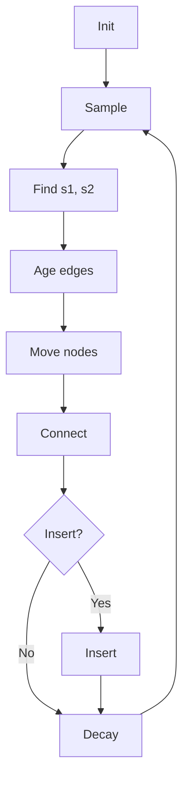
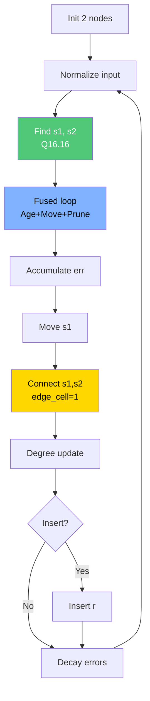

<style>
.slidev-layout {
  @apply px-10 py-6;
}
.slidev-layout h1 {
  @apply text-3xl mb-3;
}
.slidev-layout h2 {
  @apply text-xl mb-2;
}
.gng-slide h1 {
  @apply text-3xl mb-2;
}
.gng-slide .mermaid {
  transform: scale(0.85);
  transform-origin: top left;
}
</style>

# Edge-Cell Graph Encoding & Fixed-Point Arithmetic for Embedded GNG

<div class="pt-6">
  <span class="text-base font-semibold">
    Memory-Efficient Growing Neural Gas via Sparse Representation
  </span>
</div>

<div class="pt-4 text-sm opacity-75">
  IJCNN 2026 Conference Paper
</div>

<div class="abs-br m-6 flex gap-2">
  <button @click="$slidev.nav.next" class="px-2 py-1 rounded cursor-pointer">
    Press Space for next page <carbon:arrow-right />
  </button>
</div>

---
layout: default
---

# Agenda

<div class="grid grid-cols-2 gap-4 text-sm">
<div>

## 📋 Overview
- Background & Motivation
- Key Contributions
- Edge-Cell Encoding
- Fixed-Point Arithmetic

</div>
<div>

## 🔬 Experiments
- Experimental Setup
- Results (QE/TE & Memory)
- Implementation Insights
- Conclusion & Future Work

</div>
</div>

---
layout: two-cols
---

# Motivation

## Edge AI Deployment Challenges

- 📉 **RAM constraints**: 2–32 KB
- ⚡ **No FPU**: SW floating-point costly
- ⏱️ **Real-time**: Deterministic execution
- 🔌 **Offline**: No cloud connectivity
- 🔋 **Energy**: Battery-powered


<div class="mt-8">

### Target Platform

<div class="text-sm opacity-75 mt-4">
Tang Nano 9K FPGA<br>
32 KB RAM • 27 MHz • No FPU
</div>

</div>

---
layout: image-right
image: /images/data.png
---

# Why Growing Neural Gas?

<div class="pr-8">

## Advantages for Edge

- **Online learning**: No retraining
- **Incremental**: Continual updates
- **Interpretable**: Graph structure
- **Unsupervised**: No labels
- **Topology**: Preserves neighbors

<div class="mt-4 p-3 bg-blue-50 dark:bg-blue-900 rounded text-sm">
Builds graph adapting to data distribution
</div>

</div>

---
layout: default
---

# Key Contributions

<div class="grid grid-cols-2 gap-3 mt-2 text-sm">

<div class="p-3 bg-gradient-to-br from-blue-50 to-blue-100 dark:from-blue-900 dark:to-blue-800 rounded-lg shadow-lg">

## Memory Optimization

**Edge-cell encoding**
- Half-adjacency 8-bit storage
- Age+1 encoding (0 = no edge)
- **52.7% memory reduction**

<div class="text-xs mt-2">

$$E_{cells} = \frac{N_{max}(N_{max}-1)}{2}$$

</div>

</div>

<div class="p-3 bg-gradient-to-br from-green-50 to-green-100 dark:from-green-900 dark:to-green-800 rounded-lg shadow-lg">

## Computational Efficiency

**Fused update loop**
- Combined edge aging + neighbor update
- Winner-local pruning
- $O(N_{max})$ isolated-node removal

</div>

<div class="p-3 bg-gradient-to-br from-purple-50 to-purple-100 dark:from-purple-900 dark:to-purple-800 rounded-lg shadow-lg">

## Fixed-Point Arithmetic

**Q16.16 format**
- Integer-only computation
- No FPU required
- Overflow-safe distance calc

</div>

<div class="p-3 bg-gradient-to-br from-orange-50 to-orange-100 dark:from-orange-900 dark:to-orange-800 rounded-lg shadow-lg">

## Deterministic Allocation

**Static memory layout**
- Fixed-capacity arrays
- Predictable worst-case usage
- FPGA/MCU friendly

</div>

</div>

---
layout: two-cols
---

# GNG Core Algorithm (Fritzke)



::right::

<div class="pl-4 mt-12">

## Algorithm Steps

1. **Init**: Create 2 initial nodes
2. **Sample**: Pick random input
3. **Find s1, s2**: Nearest & 2nd nearest
4. **Age edges**: Increment edge ages from s1
5. **Move nodes**: Adapt s1 and neighbors
6. **Connect**: Create/refresh edge s1-s2
7. **Insert?**: Every λ steps, add node
8. **Decay**: Reduce all errors by β

<div class="mt-4 p-3 bg-blue-50 dark:bg-blue-900 rounded text-sm">
<strong>Fritzke (1995)</strong><br>
Dense adjacency + floating-point
</div>

</div>

---
layout: two-cols
---

# Proposed Method



::right::

<div class="pl-4 mt-8">

## Key Innovations

<div class="space-y-3 text-sm">

<div class="p-2 bg-green-100 dark:bg-green-900 rounded">
🟢 <strong>Q16.16 + int64</strong><br>
Fixed-point distance calculation
</div>

<div class="p-2 bg-blue-100 dark:bg-blue-900 rounded">
🔵 <strong>Fused Loop</strong><br>
Age edges + Move neighbors + Prune in one pass
</div>

<div class="p-2 bg-yellow-100 dark:bg-yellow-900 rounded">
🟡 <strong>Edge-cell encoding</strong><br>
age+1 format (0 = no edge)
</div>

<div class="p-2 bg-purple-100 dark:bg-purple-900 rounded">
🟣 <strong>Degree counters</strong><br>
O(1) isolated node detection
</div>

</div>

</div>

---
layout: default
---

# Edge-Cell Encoding

## Memory-Efficient Graph Storage

**Half-adjacency upper triangle + age+1 encoding:**

| Value | Meaning |
|-------|--------|
| `0` | No edge (inactive) |
| `v > 0` | Active edge with age = `v-1` |

<div class="text-center my-4">

$$E_{cells} = \frac{N_{max}(N_{max}-1)}{2} \text{ bytes}$$

</div>

<div class="mt-4 p-3 bg-blue-50 dark:bg-blue-900 rounded text-sm">
<strong>Benefit:</strong> Eliminates separate active-flag bit
</div>

---
layout: default
---

# Edge-Cell Encoding (Implementation)

<div class="text-sm">

### Implementation

```c {all}
// Compact 8-bit encoding
#define MAX_EDGES ((MAX_NODES*(MAX_NODES-1))/2)

// 0 = no edge, (age+1) = active
uint8_t edge_cell[MAX_EDGES];

// O(1) adjacency check
if (edge_cell[idx] > 0) {
  uint8_t age = edge_cell[idx] - 1;
  // ... process edge
}
```

<div class="mt-4 text-sm">

**Example:** $N_{max}=20$ -> 190 bytes vs 800 bytes (dense 16-bit)

</div>

</div>

---
layout: two-cols
---

# Half-Adjacency Indexing

## Upper-Triangular Mapping

<div class="my-2">

$$\text{idx}(i,j) = \frac{i(2N_{max}-i-1)}{2} + (j-i-1)$$

</div>

Constraint: $i < j$ (swap if $i > j$)

::right::

## Example ($N_{max}=4$)

<div class="text-sm">

| Edge | $(i,j)$ | Index |
|------|---------|-------|
| 0→1 | (0,1) | 0 |
| 0→2 | (0,2) | 1 |
| 0→3 | (0,3) | 2 |
| 1→2 | (1,2) | 3 |
| 1→3 | (1,3) | 4 |
| 2→3 | (2,3) | 5 |

</div>

---
layout: default
---

# Complexity Analysis

<div class="grid grid-cols-3 gap-4 mt-6">

<div class="p-4 bg-blue-50 dark:bg-blue-900 rounded-lg">
<div class="text-2xl mb-2">⚡</div>
<div class="font-bold">Adjacency Check</div>

$O(1)$ - Direct index calculation

</div>

<div class="p-4 bg-green-50 dark:bg-green-900 rounded-lg">
<div class="text-2xl mb-2">💾</div>
<div class="font-bold">Memory</div>

$O(N_{max}^2/2)$ - Half the dense matrix

</div>

<div class="p-4 bg-purple-50 dark:bg-purple-900 rounded-lg">
<div class="text-2xl mb-2">🚀</div>
<div class="font-bold">Cache-Friendly</div>
<div class="text-sm mt-2">Contiguous array, better locality</div>
</div>

</div>

<div class="mt-8 p-4 bg-yellow-50 dark:bg-yellow-900 rounded-lg text-center">

For $N_{max}=20$: **190 edges** vs 400 in full matrix

</div>

---

# Fused Winner-Local Update

Edge aging + neighbor move + prune done in a single loop:

```c
// winner s1: scan only neighbors (winner-local)
if (edge_cell[ei] != 0) {
  edge_cell[ei]++;                // age++
  node[i] += eps_n * (x - node[i]);
  if (edge_cell[ei] > TH) {
    edge_cell[ei] = 0;            // prune
    degree[i]--; degree[s1]--;
  }
}
```

**Only edges incident to s1 can exceed threshold.**

---

# Degree Counter

**Goal:** remove isolated nodes without scanning all edges

```c
uint8_t degree[MAX_NODES];

if (degree[i] == 0) deactivate(i);
```

**Complexity:** $O(N_{max})$

---

# Fixed-Point Q16.16

- Range: $[-32768, 32767.9999]$
- Resolution: $2^{-16} \approx 1.5\times10^{-5}$

```c
int32_t float_to_fixed(float x){ return round(x * (1<<16)); }
float fixed_to_float(int32_t x){ return x / (float)(1<<16); }
```

---

# Overflow-Safe Distance

```c
int64_t dist_sq = 0;
int32_t diff = w[i] - x[i];     // Q16.16
int64_t prod = (int64_t)diff * diff; // Q32.32
dist_sq += (prod >> 16);        // back to Q16.16
```

**Must** use 64-bit to avoid overflow.

---

# Data Normalization

Map input to safe range:

<div class="my-4">

$$x_{norm} = \left(\frac{x-x_{min}}{x_{max}-x_{min}}\right) \cdot 2s - s$$

</div>

In paper: **$s=10$** → Input range **$[-10,10]$**.

---

# Experimental Setup

- Dataset: **Two Moons (400 samples)**
- Epochs: **25**
- Target: **NEORV32 RV32I (no FPU)**

---

# Hyperparameters

| Parameter | Value |
|---|---:|
| $N_{max}$ | 20 |
| $\epsilon_{winner}$ | 0.03 |
| $\epsilon_{neighbor}$ | 0.001 |
| $\alpha$ | 0.5 |
| $\beta$ | 0.995 |
| $\lambda$ | 100 |
| max_age | 50 |

---

# Platform

| Item | Specification |
|---|---|
| CPU | NEORV32 RV32I (no FPU) |
| FPGA | Tang Nano 9K (GW1NR-9C) |
| RAM | 32 KB |
| Clock | 27 MHz |
| Toolchain | RISCV GCC 15.2.0 |

---

# Baselines

| Method | Arithmetic | Graph Storage |
|---|---|---|
| Float32 | float | dense adjacency |
| Edge-cells (ours) | Q16.16 | half-adj (age+1) |

---
layout: image-right
image: /images/fig1_gng_result.png
backgroundSize: contain
---

# Learned Topology

<div class="pr-8">

## Two Moons Dataset

<div class="space-y-2 mt-4 text-sm">

<div class="flex items-center gap-2">
  <div class="w-2 h-2 bg-red-500 rounded-full"></div>
  <span><strong>20 Nodes</strong></span>
</div>

<div class="flex items-center gap-2">
  <div class="w-8 h-0.5 bg-black"></div>
  <span><strong>18 Edges</strong></span>
</div>

<div class="flex items-center gap-2">
  <div class="w-2 h-2 bg-blue-100 border-2 border-blue-500 rounded-full"></div>
  <span><strong>400 Samples</strong></span>
</div>

<div class="flex items-center gap-2">
  <div>🔄</div>
  <span><strong>25 Epochs</strong></span>
</div>

</div>

<div class="mt-4 p-3 bg-green-50 dark:bg-green-900 rounded">
<div class="font-bold">✓ Perfect Topology</div>
<div class="text-sm mt-1">TE = 0.00%</div>
</div>

<div class="mt-3 p-3 bg-blue-50 dark:bg-blue-900 rounded text-sm">
💡 Preserves manifold topology
</div>

</div>

---
layout: image-right
image: /images/fig2_training_progress.png
backgroundSize: contain
---

# Training Dynamics

<div class="pr-8">

## Convergence Analysis

<div class="mt-4 space-y-3 text-sm">

<div class="p-3 bg-blue-50 dark:bg-blue-900 rounded">
<div class="font-bold">📈 Graph Growth</div>
<div class="mt-1">
• 2 → 20 nodes<br>
• Stabilizes @ epoch 15
</div>
</div>

<div class="p-3 bg-green-50 dark:bg-green-900 rounded">
<div class="font-bold">📉 QE Convergence</div>
<div class="mt-1">
• Converges @ epoch ~10<br>
• Final QE = <strong>1.1036</strong>
</div>
</div>

<div class="mt-3 p-3 bg-yellow-50 dark:bg-yellow-900 rounded">
⚡ Matches Float32 behavior
</div>

</div>

</div>

---

# Results: Accuracy

| Implementation | QE | TE (%) |
|---|---:|---:|
| Float32 (baseline) | 1.1036 | 0.00 |
| Edge-cells (ours) | 1.1036 | 0.00 |

**Fixed-point matches Float32 on Two Moons.**

---
layout: default
---

# Memory Efficiency Results

<div class="grid grid-cols-2 gap-8 mt-8">

<div>

## Comparison Table

<div class="text-sm">

| Implementation | Edge Storage | Total State |
|----------------|-------------:|------------:|
| Dense adjacency | 800 B | **1120 B** |
| Edge-cells (ours) | 210 B | **530 B** |
| **Reduction** | **73.8%** | **52.7%** |

</div>

<div class="mt-6 p-4 bg-green-50 dark:bg-green-900 rounded-lg">
<div class="text-2xl font-bold text-green-700 dark:text-green-300">52.7% ↓</div>
<div class="text-sm mt-1">Total memory reduction</div>
</div>

### Fixed Capacity ($N_{max}=20$)

- **Nodes:** 20 × 12 bytes = 240 B
- **Edges:** 190 × 1 byte = 190 B  
- **Degree counters:** 20 × 1 byte = 20 B
- **Metadata:** ~80 B

</div>

<div>

## Scaling Analysis

<div class="mt-4">

| $N_{max}$ | Dense | Edge-cells | Savings |
|-----------|------:|-----------:|--------:|
| 10 | 320 B | 125 B | 60.9% |
| 20 | 1120 B | 530 B | 52.7% |
| 32 | 2880 B | 1266 B | 56.0% |
| 40 | 4480 B | 1940 B | 56.7% |

</div>

</div>

</div>

---
layout: default
---

# Implementation Insights

## Critical Design Decisions

<div class="grid grid-cols-3 gap-4 mt-4">

<div class="p-4 bg-red-50 dark:bg-red-900 rounded-lg">
<div class="text-3xl mb-3">⚠️</div>
<div class="font-bold text-lg mb-2">Parameter Fidelity</div>
<div class="text-sm">
Incorrect $\beta$ (0.0005 vs 0.995) caused pathological growth with excessive nodes and dense connectivity.
</div>
<div class="mt-3 text-xs font-mono bg-white dark:bg-gray-800 p-2 rounded">
✓ Solution: Match original Fritzke spec exactly
</div>
</div>

<div class="p-6 bg-orange-50 dark:bg-orange-900 rounded-lg">
<div class="text-3xl mb-3">💥</div>
<div class="font-bold text-lg mb-2">Overflow Protection</div>
<div class="text-sm">
Q16.16 squared differences overflow in int32 before rescaling, corrupting winner selection.
</div>
<div class="mt-3 text-xs font-mono bg-white dark:bg-gray-800 p-2 rounded">
✓ Solution: Use int64 intermediates
</div>
</div>

<div class="p-6 bg-yellow-50 dark:bg-yellow-900 rounded-lg">
<div class="text-3xl mb-3">📊</div>
<div class="font-bold text-lg mb-2">Input Normalization</div>
<div class="text-sm">
Unbounded or poorly scaled inputs lead to precision loss or overflow in fixed-point.
</div>
<div class="mt-3 text-xs font-mono bg-white dark:bg-gray-800 p-2 rounded">
✓ Solution: Normalize to [-10, 10]
</div>
</div>

</div>

<div class="mt-8 p-6 bg-blue-50 dark:bg-blue-900 rounded-lg">
<div class="font-bold text-lg mb-2">💡 Key Takeaway</div>
Fixed-point GNG requires: (1) exact parameter reproduction, (2) overflow-safe arithmetic, (3) explicit range management. These are general requirements for embedded learning systems, not specific to our implementation.
</div>

---
layout: default
---

# Conclusion: Key Achievements

<div class="grid grid-cols-2 gap-6 mt-6">

<div class="p-4 bg-blue-50 dark:bg-blue-900 rounded-lg flex items-start gap-3">
<div class="text-3xl">🗄️</div>
<div>
<strong>52.7% Memory Reduction</strong><br>
<span class="text-sm">Edge-cell encoding: 1120 B → 530 B</span>
</div>
</div>

<div class="p-4 bg-green-50 dark:bg-green-900 rounded-lg flex items-start gap-3">
<div class="text-3xl">🔢</div>
<div>
<strong>Integer-Only Computation</strong><br>
<span class="text-sm">Q16.16 eliminates FPU dependency</span>
</div>
</div>

<div class="p-4 bg-purple-50 dark:bg-purple-900 rounded-lg flex items-start gap-3">
<div class="text-3xl">✅</div>
<div>
<strong>Accuracy Preservation</strong><br>
<span class="text-sm">QE = 1.1036, TE = 0.00% (matches Float32)</span>
</div>
</div>

<div class="p-4 bg-orange-50 dark:bg-orange-900 rounded-lg flex items-start gap-3">
<div class="text-3xl">🎯</div>
<div>
<strong>Deterministic Allocation</strong><br>
<span class="text-sm">Fixed-capacity, predictable runtime</span>
</div>
</div>

</div>

---
layout: default
---

# Conclusion: Impact

<div class="grid grid-cols-3 gap-6 mt-8">

<div class="p-5 bg-green-50 dark:bg-green-900 rounded-lg">
<div class="font-bold text-lg mb-3">✓ Deployment Ready</div>
<div class="text-sm">Validated C implementation for NEORV32 RV32I on Tang Nano 9K FPGA</div>
</div>

<div class="p-5 bg-blue-50 dark:bg-blue-900 rounded-lg">
<div class="font-bold text-lg mb-3">✓ Generalizable Approach</div>
<div class="text-sm">Design principles applicable to other topology-learning methods (GWR, IGNG, etc.)</div>
</div>

<div class="p-5 bg-purple-50 dark:bg-purple-900 rounded-lg">
<div class="font-bold text-lg mb-3">✓ Edge AI Enabler</div>
<div class="text-sm">Enables on-device continual learning for resource-constrained platforms</div>
</div>

</div>

---
layout: default
---

# Future Directions

<div class="grid grid-cols-2 gap-8 mt-8">

<div>

## 🔧 Near-Term

<div class="space-y-4">

<div class="p-4 bg-blue-50 dark:bg-blue-900 rounded">
<strong>🔌 Hardware Acceleration</strong>
<div class="text-sm mt-1">
• Custom FPGA blocks for winner search<br>
• Saturating arithmetic units<br>
• Parallel distance computation
</div>
</div>

<div class="p-4 bg-green-50 dark:bg-green-900 rounded">
<strong>⏱️ Performance Profiling</strong>
<div class="text-sm mt-1">
• Cycle-accurate timing analysis<br>
• Energy consumption measurement<br>
• Memory bandwidth characterization
</div>
</div>

</div>

</div>

<div>

## 🚀 Long-Term

<div class="space-y-4">

<div class="p-4 bg-purple-50 dark:bg-purple-900 rounded">
<strong>📊 Adaptive Quantization</strong>
<div class="text-sm mt-1">
• Online range detection<br>
• Dynamic Q-format adjustment<br>
• Per-layer/per-node precision
</div>
</div>

<div class="p-4 bg-orange-50 dark:bg-orange-900 rounded">
<strong>🧠 Algorithm Extensions</strong>
<div class="text-sm mt-1">
• Concept drift adaptation (AiGAS-style)<br>
• Hierarchical/multi-scale GNG<br>
• Batch-parallel variants
</div>
</div>

</div>

</div>

</div>

<div class="mt-8 p-6 bg-gradient-to-r from-blue-50 to-purple-50 dark:from-blue-900 dark:to-purple-900 rounded-lg">
<div class="font-bold text-lg mb-2">🎯 Research Goal</div>
Bridge the gap between classical self-organizing methods and modern edge AI constraints through hardware-software co-design.
</div>

---
layout: center
class: text-center
---

# Thank You

<div class="text-xl mt-8 mb-12">
Edge-Cell Graph Encoding & Fixed-Point Arithmetic<br>for Embedded Growing Neural Gas
</div>

<div class="mt-12 text-lg">
💬 Questions & Discussion
</div>

<div class="mt-12 text-sm opacity-75">
IJCNN 2026 Conference Paper
</div>

<div class="abs-br m-6 text-sm opacity-50">
🚀 Deployed on Tang Nano 9K FPGA (NEORV32 RV32I)
</div>
